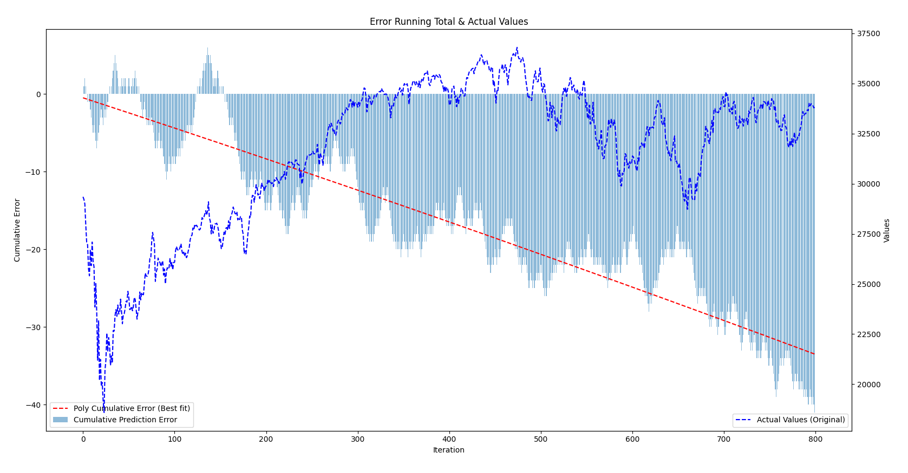
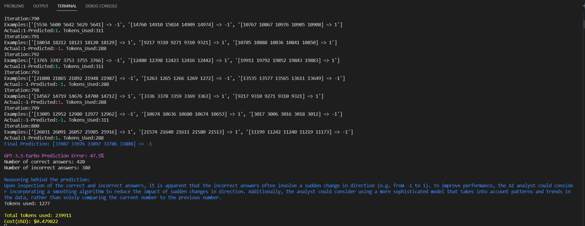

# AI-Based Number Sequence Prediction with OpenAI's Large Language Model

## Objective
This Python script showcases an AI-powered predictor for determining the next number in a sequence of numbers, and predicting whether the next number in a sequence will be higher, lower, or equal to the last number. By harnessing OpenAI's advanced natural language processing (NLP) capabilities, the script prompts the large language model (LLM) to generate a prediction. Subsequently, it assesses the accuracy of the response by comparing it to the correct continuation of the sequence and offers feedback that reflects the prediction's accuracy, which is then used for the next iteration.

This iterative feedback process aims to improve the model's performance in numerical pattern recognition and prediction tasks. The example underlines the potential of NLP models in numerical and data-driven applications.

The code is based loosely on the logic behind BabyAGI: https://github.com/yoheinakajima/babyagi, and expands on my previous attempt: https://github.com/pgalko/Next-Number-Prediction.

## How it works

The script works by running a loop that does the following steps:

* Divides the time series dataset into sequences of continuous numbers and the subsequent number following each sequence.
* If the subsequent number is higher than the last number in the sequence, it is replaced with 1; if it is lower, it is replaced with -1; and if it is equal, it is replaced with 0.
* The script takes the current sequence and performs pattern matching using historical data (never seen by the model). It selects the 3 most similar results along with the number that follows and includes them in the prompt as examples for the model to enhance the prediction.
* The script iterates through the array of sequences, feeding each one to the LLM together with the relevant examples and results, and requesting a prediction for the next number trend.
* Upon receiving the response, the script compares the predicted trend direction to the actual trend direction and provides feedback based on the accuracy assessment.
* Continues this process until the end of the dataset is reached.
* Upon completion, the script calculates the overall accuracy and plots the cumulative error, along with the polynomial line of best fit and the actual data on the right y-axes. It also calculates and outputs the total token usage and the cost(USD).

## How to use

* Clone the repository via git clone https://github.com/pgalko/Next-Number-Prediction-2.git and cd into the cloned repository.
* Install the required packages: pip install -r requirements.txt.
* Set your OpenAI  API key in the OPENAI_API_KEY environment variable.
* Set SEQUENCE_SIZE, MAX_ITERATIONS, MAX_EXAMPLES(Historical examples matching the pattern of the predicted sequence) to the desired values
* Run the sript

## Examples

**Plot of cumulative error (A steeper downward slope indicates higher prediction accuracy).:**



**Console Output:**



## LLM Prompts

**Initial Prompt**

```
You are an AI analyst and your task is to predict the next number in a sequence of numbers.
What is the next number following this sequence:{} ?
If the number is lower than the last number in the sequence, the response should be -1.
If the number is higher than the last number in the sequence, the response should be 1.
If the number is the same as the last number in the sequence, the response should be 0.
The response must be a single number without context.
As an example, here are some similar Sequences => Responses:{}.
```

**Feedback after correct prediction**

```
Correct! Congratulations! Now try with a new sequence:{}.
If the number is lower than the last number in the sequence, the response should be -1.
If the number is higher than the last number in the sequence, the response should be 1.
If the number is the same as the last number in the sequence, the response should be 0.
The response must be a single number without any context.
As an example, here are some similar Sequences => Responses:{}.
```

**Feedback after incorrect prediction**

```
Incorrect. The number that follows {} is {}. Now try with a new sequence:{}. 
If the number is lower than the last number in the sequence, the response should be -1.
If the number is higher than the last number in the sequence, the response should be 1.
If the number is the same as the last number in the sequence, the response should be 0.
The response must be a single number without any context.
As an example, here are some similar Sequences => Responses:{}.
```
## Notes

*  Please note that this isn't intended to be a stock market predictor, and should not be used as such! The DJI dataset has been used because it offers a high degree of variation and overall unpredictability to challenge the model to the max. However, any time series could be used instead. If there is a recuring pattern in the data it is likely that the model will pick it up.
*  With 800 (over 3 years of daily values) data points, the model achieves a 47.5% error rate, which is marginaly better than a random coin toss at 50%. This value fluctuates somewhat but is is always below 50%. This improvement suggests that the model is able to recognize some patterns and trends in the data, leading to more accurate predictions compared to a purely random approach. However more testing is required to confirm this theory.
* The LLM utilized for this evaluation was GPT-3.5-Turbo in order to minimize the token cost. There is potential for improved performance if alternative models, such as text-davinci-003 or GPT-4, were used instead. However, this trade-off should be considered in the context of increased token costs and potential rate limitations.
* Further improvements could be achieved by using a larger dataset and adjusting the SEQUENCE_SIZE, MAX_ITERATIONS, MAX_EXAMPLES constants. These modifications would provide the LLM with more extensive training data and a broader context for generating predictions, potentially resulting in better accuracy and overall performance.
* Based on my observations the model generally performs better with smaller prediction windows (20-50 days), showing a 35-40% error rate. Some parameter tuning required.

## Warning

This script is designed to run in a loop, iterating through the dataset and providing feedback to the model after each iteration based on the response accuracy. Running this script continuously can result in high API usage, so please use it responsibly and be mindful of your API limits. Additionally, the script requires the OpenAI API to be set up correctly, so ensure that you have properly configured the API settings before executing the script.

